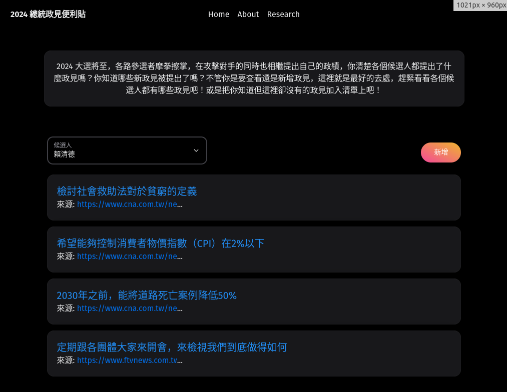

<h1>2024 總統大選

Author : Lazp
</h1>

## Screenshot

## 專案起源
2024 大選將至，各路參選者摩拳擦掌，在攻擊對手的同時也相繼提出自己的政績。但多數人並不清楚各候選人有什麼樣的政績，最後淪為意識形態的選舉，對於民主國家來說是非常不好的現象(對執政黨來說就不好說了)因此這個專案就產生了，可以讓想瞭解的人查看已整理的政績，也希望公民們可以一同參與這樣的民主過程，因此大家也都可以加上自己看到的政績，而我們也會盡可能去確認訊息真偽，創造好的民主社會。